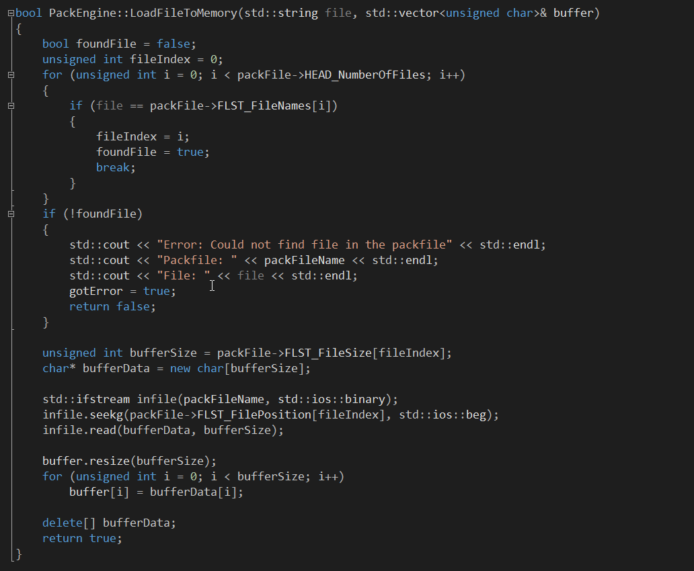

# Packfile

This project is a continuation of the MakeBox project which its purpose was to facilitate rapid serialization of game objects into memory. It could easily load files of several hundred megs. Packfile has its own binary structure (file list, data, name, position etc.).

Tags: C++, Binary file, Memory file
